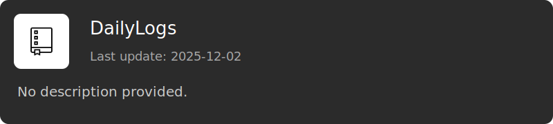

  <h2>👋 Welcome to my GitHub</h2>
  
Here is my GitHub profile.

  
I mainly touch Web / Python / Automation.

  <h2>📦 Favorite Repositories</h2>
  
 

 

---

  
    <a target="_blank" href="https://icons8.com/icon/33281/repository">Repository</a> icon by <a target="_blank" href="https://icons8.com">Icons8</a>
  
   
  Last updated: 2025.12.08 16:26 UTC

