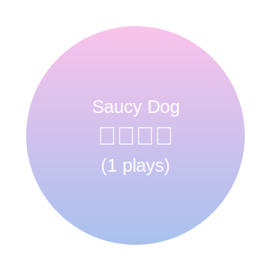

### 🫠  [k4nkan](https://kanta.it.com/)  

<table>
<tr>
<td align="center">Overview</td>
<td align="center">Languages</td>
<tr>
<td>
    
</td>
<td>
    
</td>
</tr>
</table>

---

### 🎵 Favorite Tracks
<table border="0" cellspacing="0" cellpadding="0">
<tr>
<td align="center">Total</td>
<td align="center">Today</td>
</tr>
<tr>
<td align="center">
    
</td>
<td align="center">
    
</td>
</tr>
</table>

---

### 📚 Log
- _[Last updated](https://github.com/k4nkan/k4nkan/actions): 2025.10.18 05:29 UTC_
